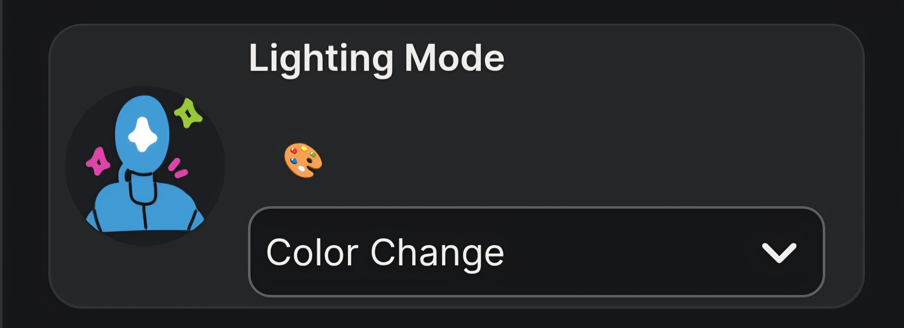
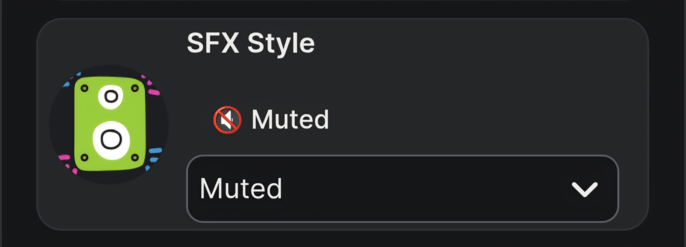
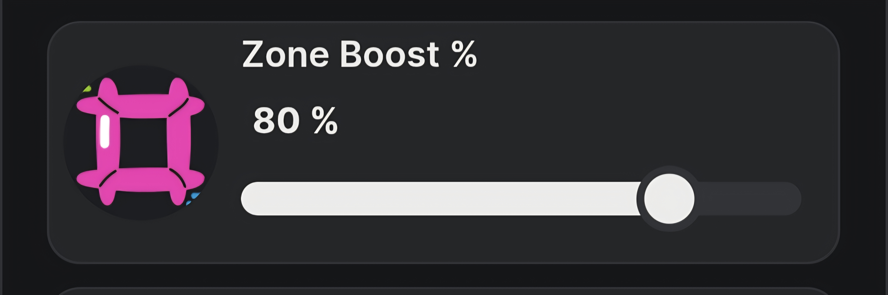
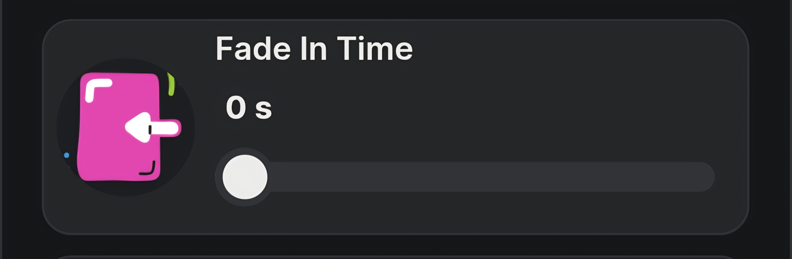
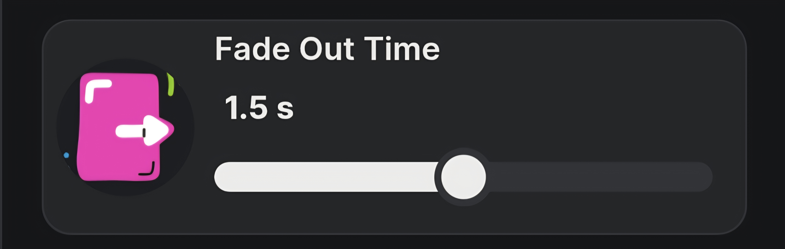
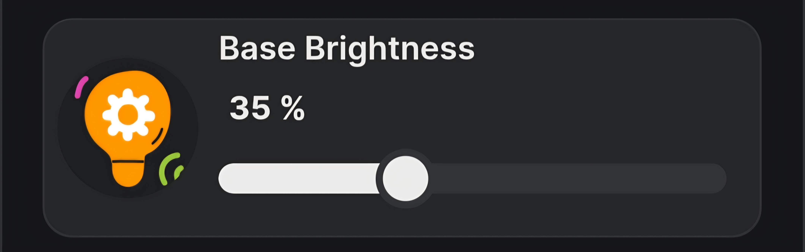
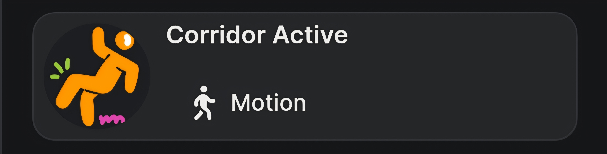
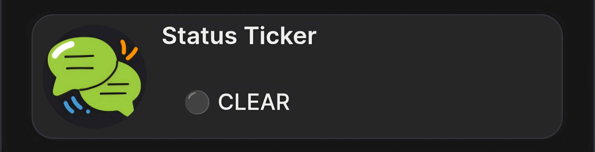

# ⚡ ZoneLight Fun

### *Real-time spatial zone tracking, addressable LED segment control, and fart sounds — because why not*

**ZoneLight Fun** turns a Shelly Presence Gen4 sensor into a spatial lighting controller that tracks people through zones and lights up WLED segments as they move. Add a Shelly Wall Display and it plays sound effects too. Walk through zone 3 and the strip flares to 97% with a drum hit. Or a fart. Your call.

This started as a proof of concept — can a Shelly script map presence zones to individual WLED segments in real time? Turns out it can. Then the kids got involved, and it became a family project with cartwheels through zones, office-chair speed tests, and an argument about which fart sound is the funniest.

Built by **SPARK_LABS**.

<div align="center">
  
</div>

<p align="center"><em>ZoneLight Fun (right) alongside Advanced Motion Pro (left) — two SPARK_LABS virtual appliances managing the same corridor from different devices.</em></p>

---

## 📋 Table of Contents

1. [What Is This](#-what-is-this)
2. [The Story](#-the-story)
3. [Hardware](#-hardware)
4. [How It Works](#-how-it-works)
5. [Lighting Modes](#-lighting-modes)
6. [SFX Integration](#-sfx-integration)
7. [Virtual Dashboard UI](#-virtual-dashboard-ui)
8. [Zone-to-Segment Mapping](#-zone-to-segment-mapping)
9. [Quick Start (Installer)](#-quick-start-installer)
10. [Companion Mode — Advanced Motion Pro](#-companion-mode--advanced-motion-pro)
11. [Known Issues & Quirks](#-known-issues--quirks)
12. [What's Next](#-whats-next)
13. [Repository Structure](#-repository-structure)
14. [License & Attribution](#-license--attribution)

---

## 🤔 What Is This

A concept project that proves addressable LED strips can be controlled per-segment based on real-time presence zone data — all running on a single Shelly script with no cloud, no Home Assistant middleware, and no external processing.

The Shelly Presence Gen4 divides a space into zones and reports enter/leave/counter events per zone. ZoneLight Fun maps each zone to a WLED segment, boosts the segment brightness on entry, fades it back on exit, and optionally fires a sound effect through a Shelly Wall Display. The whole thing runs from a virtual device card in the Shelly app with mode selection, brightness sliders, and a live status ticker.

It is not a finished product. It is a playground. Treat it accordingly.

---

## 📖 The Story

There was no grand plan here. The Shelly Presence Gen4 arrived, it got mounted in the corridor ceiling, and the question was simple: *can we make the LED strip react to exactly where someone is standing, not just whether someone is in the room?*

The answer was yes — and then it got fun.

The first test rig was a wheeled office chair. Push off from one end of the corridor, roll through four zones, and watch the segments light up in sequence. The kids saw this and immediately escalated to cartwheels, sprinting, and competitive zone-triggering. When the sound effects got added via the Wall Display, the corridor turned into a musical instrument. Walk through zone 1 — drum hit. Zone 2 — guitar riff. Zone 3 — fart noise (the kids' favourite, obviously).

The old Gen1 PIR sensors are still in the corridor too. We found them slightly more responsive than the Presence sensor for simple motion detection, so both systems run in parallel — ZoneLight Fun handles the spatial LED magic, while Advanced Motion Pro on the dimmer handles the time-of-day ceiling pendant logic. They talk to each other via HTTP callbacks.

This project has been a great way to involve the kids in what dad actually does with all those Shelly boxes. They helped design the sound maps, argued about which lighting mode looks best, and genuinely enjoy walking down their own corridor.

---

## 💻 Hardware

### Reference Install

| Component | Role | IP |
|-----------|------|-----|
| **Shelly Presence Gen4** | Host — runs the Brain, provides zone tracking | `192.168.5.90` |
| **WLED controller (Dig Octa)** | Drives the addressable LED strip — receives JSON API commands | `192.168.4.175` |
| **Shelly Wall Display** | Audio output — plays sound clips via `Media.MediaPlayer.PlayAudioClip` | `192.168.4.174` |
| **Shelly Pro Dimmer 2PM** | Companion — ceiling pendant control via Advanced Motion Pro | `192.168.4.243` |
| **Shelly Motion Gen1** ×2 | Legacy PIR sensors — still in service, feeding Advanced Motion Pro | `192.168.0.161`, `.162` |

### WLED Setup

The corridor runs a serious strip: **30 metres** of WS2814 (SK6812) RGBWW, 60 LEDs/m, powered by a 30A PSU through a **Dig Octa** controller. Each physical segment maps to a WLED segment on a separate Dig Octa channel, with every 3 LEDs grouped as a single addressable unit.

This is not a requirement — any WLED controller with segment support will work. The Dig Octa was chosen because 30m of RGBWW at full brightness draws real current and needs proper power distribution.

### Audio Note

Sound effects are triggered via HTTP calls to the Shelly Wall Display's `Media.MediaPlayer.PlayAudioClip` RPC endpoint. The Wall Display processes audio clips locally, and this adds a noticeable delay to zone activation — the dispatch gate prioritises WLED commands over SFX calls, but the HTTP round-trip to the Wall Display still costs time in the queue.

The SFX system can be adapted to trigger Home Assistant automations instead, using the same HTTP endpoint pattern pointed at HA webhook URLs. This would allow any audio output device (speakers, media players, etc.) to serve as the sound source.

---

## ⚙️ How It Works

### Zone → Segment Mapping

The Presence Gen4 defines up to 5 zones. ZoneLight Fun maps each zone to a WLED segment ID:

```
Presence Zone 201 ──→ WLED Segment 4
Presence Zone 202 ──→ WLED Segment 3
Presence Zone 203 ──→ WLED Segment 2
Presence Zone 204 ──→ WLED Segment 1
Segment 0 ──→ Ambient/background (always base brightness)
```

The mapping is reversed (zone 201 → segment 4, zone 204 → segment 1) because the physical strip runs in the opposite direction to the Presence sensor's zone numbering. This is configurable in the `ZN` array at the top of the Brain script.

### Event Flow

```
Person enters Zone 202
  → Presence fires presencezone:202 enter event
    → Brain maps zone 202 → segment 3
    → segment 3 brightness boosted to base + boost%
    → mode's "enter" overlay properties applied (colour shifts, effects)
    → SFX clip fired for zone 2 (if not Muted)
    → status ticker updates: 🟢 Fire | z202 | 1obj

Person leaves Zone 202
  → Presence fires presencezone:202 leave event
    → segment 3 brightness fades back to base ambient level
    → mode's "leave" overlay properties applied

All zones + PIRs clear
  → full corridor off with fade-out transition
  → companion callback sent to Advanced Motion Pro
```

### Dispatch Gate

All outbound HTTP commands funnel through a single throttled queue with priority ordering: **WLED first, then Dimmer, then SFX**. A coalesce window (default 80ms) merges rapid zone events into a single WLED API call — preventing the strip from flickering when someone walks quickly across zone boundaries.

### Mode Templates

Each lighting mode (White, Rainbow, Color Change, Fire) is stored as a KVS key with its own brightness, transition, preset ID, and optional per-segment enter/leave property overlays. Switching modes reloads the template and resets the sliders to mode defaults. Adding a new mode is a KVS write — zero code changes to the Brain.

---

## 🎨 Lighting Modes

| Mode | Preset | Vibe | Dimmer Sync |
|------|--------|------|-------------|
| ⚪ **White** | `ps:1` | Clean warm white — ambient corridor lighting | Yes — base 10%, boost 60% |
| 🌈 **Rainbow** | `ps:2` | Full RGB rainbow cycle, max boost | No — dimmer stays off |
| 🎨 **Color Change** | `ps:3` | Smooth colour transitions with dimmer accent | Yes — base 15%, boost 40% |
| 🔥 **Fire** | `ps:4` | Warm flickering fire effect | Yes — base 8%, boost 30% |

Each mode defines independent WLED and dimmer brightness/transition values. Modes with dimmer sync disabled (`d_base: 0, d_boost: 0`) keep the ceiling pendant off entirely — useful for pure WLED effect modes where overhead light would wash out the colours.

---

## 🔊 SFX Integration

Sound effects are mapped per zone, per style. The Shelly Wall Display plays audio clips by clip ID via its RPC endpoint.

| Style | Zone 1 | Zone 2 | Zone 3 | Zone 4 |
|-------|--------|--------|--------|--------|
| 🥁 **Drums** | kick | snare | hi-hat | crash |
| 🎸 **Guitar** | chord 1 | chord 2 | riff | strum |
| 👏 **Clap** | clap 1 | clap 2 | clap 3 | big clap |
| 💨 **Fart** | short | long | squeaky | thunderous |
| 🎹 **Funny Piano** | note 1 | note 2 | note 3 | chord |
| 🔇 **Muted** | — | — | — | — |

SFX style is selectable from the virtual dashboard dropdown. Set to **Muted** for silent operation (guests, bedtime, general sanity).

The clip-to-zone mapping is stored in KVS (`zl_fun_s_<style>`) and loaded on boot. Custom sound maps can be created by adding new KVS keys without modifying the Brain script.

> **Heads up:** Audio playback on the Wall Display introduces a measurable delay to the dispatch queue. The WLED segment update always fires first (highest priority), but the SFX HTTP call queues behind it and the 250ms cooldown applies. In fast zone transitions, some clips may be skipped in favour of the latest zone's clip (latest-wins slot).

---

## 📊 Virtual Dashboard UI

**8 virtual components** under a single control card:

<!-- PLACEHOLDER: Replace with actual VC screenshots when available -->

| # | UI Component | Type | Direction | Function |
|---|---|---|---|---|
| 1 | **Lighting Mode**  | Dropdown | User → Brain | Select active mode: White, Rainbow, Color Change, Fire. Reloads mode template and resets sliders. |
| 2 | **SFX Style**  | Dropdown | User → Brain | Select sound map: Drums, Guitar, Clap, Fart, Funny Piano, Muted. |
| 3 | **Zone Boost %**  | Slider | User ↔ Brain | Additional brightness applied to the active zone segment (0–100%). |
| 4 | **Fade In Time**  | Slider | User ↔ Brain | Zone enter transition speed (0–3s). |
| 5 | **Fade Out Time**  | Slider | User ↔ Brain | Zone leave transition speed (0–3s). |
| 6 | **Base Brightness**  | Slider | User ↔ Brain | Ambient brightness for all non-active segments (0–100%). |
| 7 | **Corridor Active**  | Label | Brain → UI | Live presence indicator — true while any zone or PIR reports occupancy. |
| 8 | **Status Ticker**  | Label | Brain → UI | Live readout: `🟢 Fire | z202 | 1obj` or `⚫ CLEAR`. |

### Slider Contract

When you switch lighting modes, the sliders reset to that mode's default values. If you then manually adjust a slider, your value holds until the next mode switch. This prevents mode changes from fighting with manual tweaks mid-session.

---

## 🗺️ Zone-to-Segment Mapping

Getting this right is the key to a clean install. Each Presence zone needs to map to the correct WLED segment, accounting for physical strip direction and segment numbering.

### How to Set It Up

1. **Define your WLED segments.** In the WLED web UI, split your strip into segments matching your physical corridor zones. Note each segment's ID.
2. **Define your Presence zones.** In the Shelly app, configure Presence zones to cover the corresponding physical areas. Note each zone's ID (200-series numbers).
3. **Map them in the Brain.** Edit the `ZN` array at the top of the script:

```javascript
let ZN = [
    {pz: 201, sg: 4},   // Presence zone 201 → WLED segment 4
    {pz: 202, sg: 3},   // Presence zone 202 → WLED segment 3
    {pz: 203, sg: 2},   // ...
    {pz: 204, sg: 1}
];
let S5 = 0;  // Background/ambient segment
```

The order matters — the Brain iterates this array to resolve zone events to segment commands. `S5` is the catch-all ambient segment (always at base brightness).

> **Note:** The current Brain contains some site-specific logic for triggering zones not directly covered by the Presence sensor in my corridor layout. A cleaned-up version with this logic removed will be published separately for wider usability.

---

## 🛠️ Quick Start (Installer)

### Phase 1 — Setup Wizard

1. Save `ZoneLight_Fun_Setup.js` to an empty script slot on the Presence Gen4.
2. Edit `SITE_CONFIG` — set your WLED IP, Wall Display IP, dimmer IP, Presence zone IDs, and default slider values.
3. Run the script. Watch the console for `✅ ZONELIGHT FUN MATRIX INFRASTRUCTURE COMPLETE`.
4. Delete the Setup Wizard.

### Phase 2 — The Brain

1. Save `ZoneLight_Fun_Brain.js` into a permanent script slot.
2. Tick **Run on Startup** and start the script.
3. Verify the console shows `[ZLF] ONLINE · VERSION v3.2`.
4. Walk through a zone — confirm the WLED segment lights up and the status ticker updates.

### Phase 3 — Virtual Device Card (Optional)

1. Open the Presence device in the Shelly Smart Control app.
2. Navigate to the **ZoneLight Fun Panel** group.
3. Tap Settings → **Extract virtual group as device** (requires Shelly Premium).

---

## 🤝 Companion Mode — Advanced Motion Pro

ZoneLight Fun is designed to work alongside **Advanced Motion Pro** — a time-of-day adaptive dimmer controller running on the corridor's Pro Dimmer 2PM.

When `override: true` is set in the ZoneLight config, the Brain delegates all electrical dimmer control to Advanced Motion Pro instead of driving it directly:

```
Corridor becomes occupied → ZoneLight calls Advanced Motion Pro's /motion?sensor=zonelight
Corridor fully clears     → ZoneLight calls /motion_end?sensor=zonelight
```

This division of labour means ZoneLight handles the fun stuff (WLED zones, segment effects, sound) while Advanced Motion Pro handles the practical stuff (time-of-day brightness, hold timers, graceful fade-outs on the ceiling pendant).

When `override: false`, ZoneLight Fun drives both the WLED strip and the dimmer directly — standalone mode for simpler setups.

---

## ⚠️ Known Issues & Quirks

This is a beta concept release. It works, it's fun, but it has rough edges.

* **SFX dispatch delay.** Audio clips on the Wall Display add latency to the dispatch queue. In fast transitions, zone lighting may noticeably lag behind physical movement when SFX is enabled. Set SFX to Muted for the fastest zone response.

* **First-event miss.** There is a known bug where the first zone enter event after the corridor has been idle does not trigger the segment boost. Likely caused by the ambient paint and the zone boost commands competing in the dispatch queue. Walking back through the zone immediately works. Under investigation.

* **Site-specific corridor logic.** The current Brain includes custom logic for triggering zones not directly within the Presence sensor's field of view — specific to my corridor layout. A general-purpose version with this logic removed is planned.

* **Gen1 PIR vs Presence responsiveness.** The legacy Shelly Motion Gen1 sensors currently feel slightly more responsive for simple corridor-occupied detection. The Presence Gen4 is better at spatial tracking but introduces a small detection latency on initial entry. Both are kept in the system for now — this is still being evaluated.

* **Presence price point.** The Presence Gen4 is significantly more expensive than a basic PIR. For a standard corridor where zone-level tracking is not needed, a PIR is the right tool. ZoneLight Fun exists specifically because zone tracking is fun, not because it is the most economical approach.

* **Single Presence sensor.** The current architecture supports one Presence sensor. Multi-Presence support (covering larger spaces or L-shaped corridors) is planned for a future release.

---

## 🔮 What's Next

This is an ongoing project. Some things on the list:

* **Holiday modes** — Christmas and Halloween lighting presets with seasonal colour palettes and effects
* **World Cup integration** — an API-driven mode that displays club colours for the current match and triggers a goal celebration effect on the strip. Stay tuned.
* **Multi-Presence support** — combining multiple Presence sensors for larger or non-linear spaces
* **Cleaned-up general release** — a version with site-specific corridor logic removed for wider usability
* **Improved zone response** — reducing dispatch latency and fixing the first-event miss bug
* **HA automation hooks** — exposing zone events as webhook triggers for deeper Home Assistant integration

---

## 📂 Repository Structure

```
Shelly_ZoneLight_Fun/
├── ZoneLight_Fun_Brain.js              # Runtime engine — v3.2
├── ZoneLight_Fun_Setup.js              # Setup Wizard / installer — v3.2.4
├── README.md
└── assets/
    ├── AM_ZLF_UI.jpg                   # Hero — ZoneLight Fun + Advanced Motion Pro panels
    ├── ZL_VC_MODE.jpg                  # VC — lighting mode dropdown
    ├── ZL_VC_SFX.jpg                   # VC — SFX style dropdown
    ├── ZL_VC_BOOST.jpg                 # VC — zone boost slider
    ├── ZL_VC_FADEIN.jpg                # VC — fade in slider
    ├── ZL_VC_FADEOUT.jpg               # VC — fade out slider
    ├── ZL_VC_BASE.jpg                  # VC — base brightness slider
    ├── ZL_VC_ACTIVE.jpg                # VC — corridor active indicator
    └── ZL_VC_TICKER.jpg               # VC — status ticker
```

---

## ⚖️ License & Attribution

Developed by **⚡ SPARK_LABS**.

### Acknowledgements

* **[Shelly](https://www.shelly.com/)** — for the hardware platform, the mJS scripting engine, the Presence Gen4 zone-tracking firmware, and the virtual-component framework.
* **[Shelly Academy](https://academy.shelly.com/)** — for the scripting courses and API walkthroughs that informed the patterns used across all SPARK_LABS projects.
* **[WLED](https://kno.wled.ge/)** — for the open-source LED firmware and JSON API that makes per-segment control possible over HTTP.
* **Icons** — UI component icons sourced from [Icons8](https://icons8.com) (`https://img.icons8.com`).

### Special Thanks

To the three kids who turned a proof of concept into a family project. The cartwheels, the fart sounds, and the competitive zone-sprinting made this the most fun I have ever had writing firmware.

---

**⚡ SPARK_LABS** — **S**helly **P**owered **A**utomation **R**eliable **K**ontrol

Technician, Installer & Shelly Academy Graduate at [Recowatt Malta](https://recowatt.com)

[github.com/Nc-eW22](https://github.com/Nc-eW22)

*Turning everyday Shelly devices into truly smart virtual appliances.*
